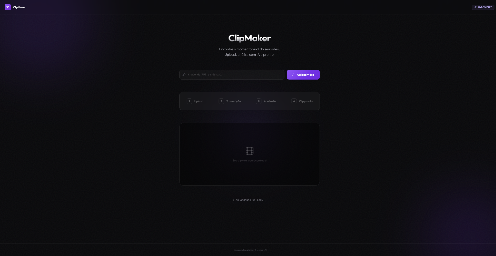

# ✂️ ClipMaker

**Find the viral moment in any video — powered by AI.**

ClipMaker automatically transcribes your video, analyzes the content with Gemini AI, and extracts the most engaging 30–60 second clip ready to share.



<p align="center">
  <a href="https://GustavoHCastelan.github.io/clipmaker">🔗 Live Demo</a> •
  <a href="#how-it-works">How It Works</a> •
  <a href="#tech-stack">Tech Stack</a>
</p>

---

## How It Works

```
Upload video → Auto-transcribe → AI finds the viral moment → Clip ready
```

1. **Upload** — Your video is uploaded to Cloudinary with automatic speech-to-text transcription.
2. **Transcribe** — ClipMaker polls Cloudinary until the transcript is ready.
3. **AI Analysis** — The transcript is sent to Google Gemini, which identifies the most engaging, funny, or surprising segment.
4. **Clip Delivered** — Cloudinary returns a trimmed video URL with the exact timestamps — no re-encoding needed.

## Tech Stack

| Layer | Technology |
|-------|-----------|
| **Frontend** | HTML5, Tailwind CSS, Vanilla JS |
| **Video Processing** | Cloudinary (upload, transcription, trimming) |
| **AI Model** | Google Gemini 2.5 Flash |
| **Animations** | GSAP |
| **Icons** | Lucide Icons |
| **Typography** | Outfit + JetBrains Mono |

## Getting Started

### Prerequisites

- A **Google Gemini API key** → [Get one here](https://aistudio.google.com/apikey)

### Run Locally

```bash
git clone https://github.com/GustavoHCastelan/clipmaker.git
cd clipmaker
```

Open `index.html` in your browser — that's it. No build step, no dependencies to install.

> **Note:** You'll need a Gemini API key to use the AI analysis feature. Paste it in the input field before uploading.

## Project Structure

```
clipmaker/
├── index.html     # Full application (single file)
├── preview.png    # Screenshot for README
└── README.md
```

## Key Features

- **Zero-config** — Single HTML file, no build tools required
- **Real-time pipeline tracker** — Visual step-by-step progress (Upload → Transcription → AI → Done)
- **Retry logic** — Automatic retries for both transcription polling and Gemini API calls
- **Glassmorphism UI** — Dark theme with ambient lighting, noise textures, and smooth GSAP animations
- **Responsive** — Works from iPhone SE to 4K displays

## Roadmap

- [ ] Support multiple clip suggestions (top 3 viral moments)
- [ ] Vertical crop option for Reels/TikTok/Shorts
- [ ] Custom duration selector
- [ ] Download button for the final clip

## Origin

Built during **NLW Operator** — Rocketseat's 22nd Next Level Week event (March 2025),  
beginner track. Three days, one real AI project, zero prior web dev experience required.

> [Rocketseat](https://rocketseat.com.br) is a Brazilian tech education platform focused  
> on practical, project-based learning.

## License

MIT © [Gustavo H. Castelan](https://github.com/GustavoHCastelan)
Originally built at [NLW Operator — Rocketseat](https://rocketseat.com.br)
